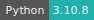

# oTree

:::: {tab-set}

::: {tab-item} 5.10.1

[](https://cloud.sdu.dk/app/jobs/create?app=otree&version=5.10.1)
[](interactive_apps.md)


* **Operating System:** 
* **Terminal:** 
* **Shell:** 
* **Editor:**   
* **Package Manager:**   
* **Programming Language:**   
* **Database:** 

:::

::: {tab-item} 3.4.0

[](https://cloud.sdu.dk/app/jobs/create?app=otree&version=3.4.0)
[](interactive_apps.md)


* **Operating System:** 
* **Terminal:** 
* **Shell:** 
* **Editor:**   
* **Package Manager:**   
* **Programming Language:**   
* **Database:**  

:::

::: {tab-item} 3.2.2

[](https://cloud.sdu.dk/app/jobs/create?app=otree&version=3.2.2)
[](interactive_apps.md)


:::

::: {tab-item} 2.5.7

[](https://cloud.sdu.dk/app/jobs/create?app=otree&version=2.5.7-3)
[](interactive_apps.md)


:::

::::

oTree is a framework based on Python which allows to build:

- multiplayer strategy games (e.g. prisoner’s dilemma, public goods game, and auctions);
- controlled behavioral experiments in economics, psychology, and related fields;
- surveys and quizzes.

oTree 5 is based on oTree Lite, a new implementation of oTree that runs as a self-contained framework, not dependent on Django.

For more information, check [here](https://www.otree.org) and [here](https://otree.readthedocs.io/en/latest/misc/otreelite.html).

## Input folder

The app receives a mandatory parameter, *Input Folder*, namely the directory with the source code including the oTree file `settings.py`,  or an empty directory in order to create a new project.

## Running an existing oTree project

In order to use oTree in production, it is necessary to run the production server, via the *prodserver* command.

While starting the server with *prodserver* command, by default the application start [PostgreSQL](https://www.postgresql.org/) v15 database server.

``` {note}
Once selected the *prodserver* option, the database is first resetted to a fresh state, all data are deleted.
```

If the user is just testing the app, she/he can use the *devserver* command.

## Creating a new oTree project

The command option *startproject* allows to create a new oTree project. Once selected this option, it is necessary to choose the name for the project folder. Once the project is created, the user is automatically moved in the oTree project directory.

In addition the user:

- can add the *startapp* option to create a new oTree application and choose its name

and/or

- select the *prodserver* or *devserver* option

## Input parameters and command options

The user can select one or more optional parameters, e.g.:

- *PRODUCTION Mode* set to 1 enables PRODUCTION mode (default is 0 for DEBUG mode)

- *ADMIN password* allows to change the password (by default the username is *admin* and the password is *admin-password*)

- *AUTH LEVEL* set to "STUDY" enables restricted access (default is "DEMO")

- *zip* zip the otree project into an archive, user should be inside the project folder.

## Automated testing

Tests of the project apps can be launched by adding *use_browser_bots=True* to the respective session configuration in `settings.py` and using the option `test --export`. The `--export` flag is added to export the data generated by the bots to a CSV file stored in oTree’s project directory. The user needs to choose the directory name.

In order to simulate the app in a more realistic way, instead of using the `test --export` command, one can run the server and create a session.
The pages will auto-play with
browser bots once the start links are accessed.

``` {note}
For oTree<5 the string to add to the setting file is *'use_browser_bots': True*.
```

## Development mode

In development mode, the user can edit the application files via the terminal interface and test the application before production.
It is possible start a development server via the terminal interface,
via the command

```console
$ nginx & otree devserver
```

The server can be started from a  `*.otreezip` format file via the command

```console
$ nginx & otree zipserver file.otreezip
```

oTree Lite does not implement support for certain features found in older oTree projects.
To check it is possible to run *otree update_my_code*, which will highlights the changes necessary to make before your code can run on oTree Lite.

``` {note}
When the server is started with *devserver* or *zipserver* SQLite database is used.
```

## Initialization

For information on how to use the *Additional dependencies* parameter, please refer to the [Initialization - Bash script](../hands-on/init-sh.md) and [Initialization - pip packages](../hands-on/init-pip.md) section of the documentation.
