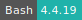
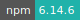

# Overleaf

:::: {tab-set}

::: {tab-item} 4.2.0

[](https://cloud.sdu.dk/app/jobs/create?app=overleaf&version=4.2.0)
[](interactive_apps.md)

* **Operating System:** 
* **Terminal:** 
* **Shell:**   
* **Editor:**   
* **Package Manager:**    
* **Programming Language:**   
* **Database:**  

:::

::: {tab-item} 4.1.6

[](https://cloud.sdu.dk/app/jobs/create?app=overleaf&version=4.1.6-1)
[](interactive_apps.md)

* **Operating System:** 
* **Terminal:** 
* **Shell:**   
* **Editor:**   
* **Package Manager:**    
* **Programming Language:**   
* **Database:**  

:::

::: {tab-item} 3.5.11

[](https://cloud.sdu.dk/app/jobs/create?app=overleaf&version=3.5.11)
[](interactive_apps.md)

* **Operating System:** 
* **Terminal:** 
* **Shell:**   
* **Editor:**   
* **Package Manager:**    
* **Programming Language:**   
* **Database:**  

:::

::: {tab-item} 3.0.1

[](https://cloud.sdu.dk/app/jobs/create?app=overleaf&version=3.0.1)
[](interactive_apps.md)

* **Operating System:** 
* **Terminal:** 
* **Shell:** 
* **Editor:**   
* **Package Manager:**   
* **Programming Language:**   
* **Database:**  

:::

::: {tab-item} 2.4.2

[](https://cloud.sdu.dk/app/jobs/create?app=overleaf&version=2.4.2)
[](interactive_apps.md)

* **Operating System:** 
* **Shell:** 
* **Editor:** 
* **Package Manager:**   
* **Programming Language:**   
* **Database:**  

:::

::::

[Overleaf](https://www.overleaf.com/) is an open-source online real-time collaborative [LaTeX](https://www.overleaf.com/learn/latex/Learn_LaTeX_in_30_minutes) editor.

This application allows to create an Overleaf server to compile and save LaTeX projects directly on UCloud. A base requirement of 2 cores and 3 GB memory is recommended for basic operations with around 5 concurrent users.

``` {important}
Multiple users are able to access the server and work simultaneously on the same project only if the app is deployed with a [public URL](general_settings.md#configure-custom-links).
```

## Mandatory parameters

To launch the application the user needs to select two input folders: one for the MongoDB document database and the other to store projects binary (non-text) files. In case of a new server setup, these folders must be empty.

## Restoring data from dump files

To restore the MongoDB document database the user should select the *Restore database* option.
In this case the user should mount an empty MongoDB database folder and reuse the *Project files* directory.
The latter contains a MongoDB dump of the database which needs to be restored, named `database_dump`.

When the Overleaf server is running, it will run a backup of the MongoDB database every hour.
The database can also be manually dumped from the terminal interface using the `mongodump` command.

```{hint}
Restore the database in case you need to upgrade to a new version of Overleaf.
```

## Set up an admin account

When a new server is created, it is necessary to set up an admin account by replacing `/login` in the app URL with `/launchpad`, as shown in the figure below.
<br>


<br>
The admin user should provide an email address and a password for the registration. The same email is used for the login.

After the registration, the admin is able to log in to the server account using the button in the top-right corner of the screen.

``` {note}
All users are registered in the server with an email address. However, there is no email server configured in the backend. Therefore, it is not possible to send emails to the users from the app web interface.
```

## Create and manage users

New users can be added to the database from the _admin_ menu in the top navigation bar.
<br>


<br>

In the example shown above a new user account (`user1@example.com`) is created. To activate the account the admin should first copy the app URL in a new web page and replace `/admin/register` with the string `/user/activate?token=...` displayed in the previous screen. At this point the admin should set a password for this user and click on _activate_. This will open the project page of  `user1@example.com`.

If the job URL is public, the server admin may send the activation link directly to another collaborator, who will thus be able to activate the account and log in to the server.

## Share a project

As remarked at the beginning, a registered user can share a LaTeX project with other collaborators only if the server is deployed with a [public URL](general_settings.md#configure-custom-links).

From the page of the project one should click on the _share_ button on the top navigation bar to open a dialog box similar to the following:
<br>


<br>

Here the user can add one or more collaborators registered in the server database by typing the corresponding login email. A notification will appear inside the collaborator account page. It is also possible to remove users previously added to the list or change the ownership of the shared project.

Alternatively, the admin may also share a public link of the document with non-registered users, by turning on the _link sharing_ feature, at the top of the **Share Project** dialog box. As a consequence of this feature, two public links are displayed, which enable access to the project files with different permissions.

## Manage the database

The project text files are saved in the MongoDB database along with the users registration data. Any change in the database is recorded in the folder mounted in the app container. The database name is `sharelatex` and it is served on port `27017`.
