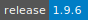

# PALMSpy

[PALMSpy](https://github.com/emolinaro/PALMSpy) is an implementation of the Personal Activity and Location Measurement System (PALMS), written in Python and integrated with Apache Spark. The program detects personal activity patterns of individual participants wearing a GPS data logger and a physical activity monitor.
