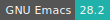
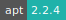
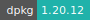
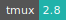

# PostgreSQL Server

:::: {tab-set}

::: {tab-item} 16.1

[](https://cloud.sdu.dk/app/jobs/create?app=postgresql&version=16.1)


* **Operating System:** 
* **Terminal:** 
* **Shell:**   
* **Editor:**   
* **Package Manager:**    
* **Programming Language:**  
* **Database:** 
* **Extension:** 

:::

::: {tab-item} 15.4

[](https://cloud.sdu.dk/app/jobs/create?app=postgresql&version=15.4)


* **Operating System:** 
* **Terminal:** 
* **Shell:**   
* **Editor:**   
* **Package Manager:**    
* **Programming Language:**  
* **Database:** 
* **Extension:** 

:::

::: {tab-item} 14.5

[](https://cloud.sdu.dk/app/jobs/create?app=postgresql&version=14.5)


* **Operating System:** 
* **Terminal:** 
* **Shell:** 
* **Editor:**   
* **Package Manager:**  
* **Database:**  

:::

::: {tab-item} 13.3

[](https://cloud.sdu.dk/app/jobs/create?app=postgresql&version=13.3)


* **Operating System:** 
* **Terminal:** 
* **Shell:** 
* **Editor:**   
* **Package Manager:**  
* **Database:**  

:::

::::

PostgreSQL is an object-relational database management system based on [POSTGRES 4.2](https://dsf.berkeley.edu/postgres.html).

For more information, check the official documentation [here](https://www.postgresql.org/docs/).

## Initialization

For information on how to use the *Initialization* parameter, please refer to the [Use Cases](../hands-on/use-cases.md) section of the documentation.

## Create a new server

The app requires to set the parameter *Database path*, which is used to import the PostgreSQL database folder from a UCloud workspace. If the folder is empty, a new database will be initialized. In this case, after the initialization procedure is completed, the following lines will be displayed in the output logs:

```xml
PostgreSQL init process complete; ready for start up.

2023-03-15 07:32:15.069 CET [8] LOG:  starting PostgreSQL 16.0 (Debian 16.0-1.pgdg120+1) on x86_64-pc-linux-gnu, compiled by gcc (Debian 10.2.1-6) 10.2.1 20210110, 64-bit
2023-03-15 07:32:15.071 CET [8] LOG:  listening on IPv4 address "0.0.0.0", port 5432
2023-03-15 07:32:15.071 CET [8] LOG:  listening on IPv6 address "::", port 5432
2023-03-15 07:32:15.073 CET [8] LOG:  listening on Unix socket "/var/run/postgresql/.s.PGSQL.5432"
2023-03-15 07:32:15.079 CET [53] LOG:  database system was shut down at 2023-03-15 07:32:14 CET
2023-03-15 07:32:15.087 CET [8] LOG:  database system is ready to accept connections
```

The name of the PostgreSQL superuser is `ucloud`. By default, the database name and the superuser password are both equal to `ucloud`. These can be changed using the parameters *Password* (or *Password file*) and *Database name*, respectively.

``` {note}
Additional arguments for the database initialization can be passed as a string using the *Database initialization* optional parameter.
```

To access and modify the PostgreSQL server, the user should open the app [terminal interface](../guide/submitting.md#job-running) and access the database with the command:

```console
$ psql <db>
```

where `<db>` must be replaced with the name of the database. There is no need to add the admin password to login from the app terminal.

## Connect to the server

As discussed above, the user can access the PostgreSQL console directly from the app terminal interface. However, it is also possible to connect to the server using an external client application.

On the one hand, if the client application runs within another interactive app available on UCloud, one can connect directly to the PostgreSQL server as described [here](./general_settings.md#connect-to-other-jobs). In this case the server *hostname* is configured as an external parameter via the *Connect to other jobs* optional parameter.

On the other hand, if the PosgreSQL client is a third-party application not running on UCloud, it is necessary to assign a [static IP address](./general_settings.md#attach-public-ip-addresses) to the server, using the *Add public IP* option. In addition, it is necessary to edit the client configuration file `pg_hba.conf` and change the lines referring to the host as reported below:

```ini
# IPv4 local connections:
host    all             all             0.0.0.0/0               md5
# IPv6 local connections:
host    all             all             ::0/0                   md5
```

Notice that, by default, the main configuration file `postgresql.conf`, located in the database folder, is created with the line: `listen_address = '*'`. This setting allows connections from *all* available IP interfaces.

``` {note}
By default remote access to the PostgreSQL server is established via a TCP/IP connection over port ``5432``. The static IP address must listen to the same port to establish connection.
```
