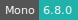

# Proteomics Sandbox

:::: {tab-set}

::: {tab-item} Oct2023

* **Operating System:** 
* **Terminal:** 
* **Shell:** 
* **Editor:**   
* **Package Manager:**   
* **Programming Language:**     
* **Utility:**  

:::

::: {tab-item} Mar2023

* **Operating System:** 
* **Terminal:** 
* **Shell:** 
* **Editor:**   
* **Package Manager:**   
* **Programming Language:**     
* **Utility:**  

:::

::::

The Proteomics Sandbox is an excellent resource for biomedical students and non-computational researchers to learn and apply clinical proteomics.
It provides a stable platform for proteomics software tools and offers a user-friendly interface.
It is easy to use and does not require extensive coding knowledge.

## Software tools

The software tools available in the sandbox feature automated peptide and protein identification and quantification,
comprehensive proteomics data analysis, visualization tools for spectral matches, a user-friendly interface for performing peptide searches,
and a tool for visualizing and analyzing peptide search results.

A complete list of the available software and its functionalities is repoted below:

* [FragPipe](https://fragpipe.nesvilab.org/):
     * Automated peptide and protein identification and quantification using the MSFragger search engine.
     * Supports the identification of arbitrary PTMs.
     * Includes additional tools for post-processing and visualization of search results.
* [MaxQuant](https://www.maxquant.org/):
    * Comprehensive software suite for proteomics data analysis.
    * Includes protein and peptide identification, quantification, and visualization of spectral matches.
    * Features an advanced search engine and a user-friendly graphical interface.
* [PDV](https://www.maxquant.org/):
    * Visualization tool for spectral matches, particularly those obtained from MSFragger searches.
    * Allows users to inspect and evaluate the quality of the matches.
    * Supports annotation and customization of plots.
* [SearchGUI](http://compomics.github.io/projects/searchgui):
    * User-friendly interface for performing peptide searches using multiple search engines (e.g. MSFragger, X!Tandem, OMSSA).
    * Supports a wide range of search options and post-processing features.
* [PeptideShaker](http://compomics.github.io/projects/peptide-shaker#:~:text=PeptideShaker%20is%20a%20search%20engine,%2C%20Novor%2C%20DirecTag%20and%20mzIdentML.):
    * Tool for visualizing and analyzing the results of peptide searches performed with SearchGUI.
    * Includes features for filtering, annotation, and visualization of results.
    * Supports integration with other proteomics databases and software.
* [MZmine 3](https://mzmine.github.io/):
    * Open-source software specialized for mass-spectrometry data processing, with an emphasis on LC-MS data.
    * Based on the original MZmine toolbox, but has undergone comprehensive redesign and rewriting.
    * Offers a user-friendly, adaptable, and expandable platform.
    * Provides a complete set of modules addressing the entire LC-MS data analysis workflow.
* [DIA-NN](https://github.com/vdemichev/DiaNN):
    * Universal software for DIA proteomics data processing, revolutionizing proteomics in 2018 with innovative algorithms.
    * Focuses on reliability, robustness, and reproducibility with stringent statistical control, flexible data modeling, and meticulous recording of all analysis steps.
    * User-friendly with a high degree of automation, no bioinformatics expertise required, and showcases scalability by processing up to 1000 mass spec runs per hour.
    * The newly developed GUI for Linux further enhances, making DIA-NN even more accessible.

## Analyzing datasets

In order to analyze the datasets, they must be placed in a folder where you have write access.
However, making a full copy of a dataset to your own storage area can consume a large amount of space.
The Proteomics Sandbox app offers a feature that allows you to create a lightweight clone of a folder structure,
containing links to the original files instead of copies located in the `/work` directory.
