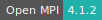
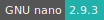
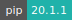

# Quantum ESPRESSO

:::: {tab-set}

::: {tab-item} 7.2-omp5

* **Operating System:** 
* **Terminal:**  
* **Shell:**   
* **Editor:**   
* **Package Manager:**    
* **Programming Language:**    
* **Database:** 
* **Utility:**  
* **Extension:** 

:::

::: {tab-item} 7.2

* **Operating System:** 
* **Terminal:**  
* **Shell:**   
* **Editor:**   
* **Package Manager:**    
* **Programming Language:**     
* **Database:** 
* **Utility:** 
* **Extension:** 

:::

::: {tab-item} 6.5

* **Operating System:** 
* **Shell:** 
* **Editor:**   
* **Package Manager:**   
* **Programming Language:**    
* **Database:** 

:::

::::

[Quantum ESPRESSO](https://www.quantum-espresso.org/) is an integrated suite of Open-Source
computer codes for electronic-structure calculations
and materials modeling at the nanoscale. It is based on
density-functional theory, plane waves, and pseudopotentials.
XCrySDen, a crystalline and molecular structure visualization
program, is also included.

More informations can be found [here](https://www.quantum-espresso.org).

## Input parameters

Before submitting the application, additional folders can be selected, in order to be available in the `/work` folder.

Examples can be found in  `/opt/q-e-qe-x/test-suite/`, where x here represents the Quantum ESPRESSO version.
