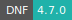

# SAS

* **Operating System:** 
* **Terminal:**  
* **Shell:**   
* **Editor:**   
* **Package Manager:**     
* **Programming Language:**     
* **Utility:** 
---

SAS is a statistical software suite for data management, advanced analytics, multivariate analysis, business intelligence, and predictive analytics.

For more information, check [here](https://go.documentation.sas.com/doc/en/pgmsascdc/9.4_3.4/pgmsaswlcm/home.htm).

## Import software license

The parameter *SAS license* must be used to import a SAS product license file.

## Connect to a network license

Depending on the user institution, it is also possible to request access to a SAS license server using the parameter *Select SAS license server*.
The license server must be added to an active project by means of a [grant application](../guide/resources-grant.md). Project admins can restrict access to the license as discussed [here](../guide/project-overview.md).
