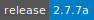
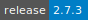

# STAR

:::: {tab-set}

::: {tab-item} 2.7.7a

:::

::: {tab-item} 2.7.3

:::

::::

Spliced Transcripts Alignment to a Reference (STAR) is a fast RNA-Seq read mapper, with support for splice-junction and fusion read detection.

STAR aligns reads by finding the Maximal Mappable Prefix (MMP) hits between reads (or read pairs) and the genome, using a Suffix Array index. Different parts of a read can be mapped to different genomic positions, corresponding to splicing or RNA-fusions. The genome index includes known splice-junctions from annotated gene models, allowing for sensitive detection of spliced reads. STAR performs local alignment, automatically soft clipping ends of reads with high mismatches.

This application uses STAR because it quickly aligns more reads than other aligner methods.

For more information, check [here](https://github.com/alexdobin/STAR).
