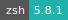
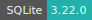

# Stata

:::: {tab-set}

::: {tab-item} 18

[](https://cloud.sdu.dk/app/jobs/create?app=stata&version=18)


* **Operating System:** 
* **Terminal:**  
* **Shell:**   
* **Editor:**   
* **Package Manager:**    
* **Programming Language:**    
* **Database:** 

:::

::: {tab-item} 17

[](https://cloud.sdu.dk/app/jobs/create?app=stata&version=17)


* **Operating System:** 
* **Terminal:** 
* **Shell:** 
* **Editor:**   
* **Package Manager:**   
* **Programming Language:**   
* **Database:** 

:::

::: {tab-item} 16

[](https://cloud.sdu.dk/app/jobs/create?app=stata&version=16-1)


* **Operating System:** 
* **Shell:** 
* **Editor:**   
* **Package Manager:**   
* **Programming Language:**    
* **Database:** 

:::

::::

Stata is a general-purpose statistical software for data science that enables users to analyze, manage, and produce graphical visualizations of data. It is primarily used by researchers in the fields of economics, biomedicine, and political science to examine data patterns.

For more information, check [here](https://www.stata.com/features/documentation/).

## Import a single-user license

The parameter *Stata license* must be used to import a Stata single-user license file.

Alternatively, the user can activate a new license using the *Terminal* window of the virtual desktop:

```console
$ cd $STATA_HOME
$ sudo ./stinit
```

In this case, the user must provide the license's *serial number*, *code* and *authorization* keys.

## Connect to a network license

Depending on the user institution, it is also possible to request access to a Stata network license server using the parameter *Select Stata license server*.
Network licenses must be added to an active project by means of a [grant application](../guide/resources-grant.md). Project admins can restrict access to the license as discussed [here](../guide/project-overview.md).
