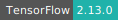
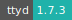
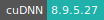
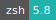
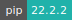
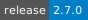

# TensorFlow

:::: {tab-set}

::: {tab-item} 23.10

[](https://cloud.sdu.dk/app/jobs/create?app=tensorflow-te&version=23.10)


* **Operating System:** 
* **Terminal:**   
* **Shell:**   
* **Editor:**   
* **Package Manager:**    
* **Programming Language:**   
* **Database:** 
* **NVIDIA Libraries:**    
* **Extension:**   

:::

::: {tab-item} 23.09

[](https://cloud.sdu.dk/app/jobs/create?app=tensorflow-te&version=23.09)


* **Operating System:** 
* **Terminal:**   
* **Shell:**   
* **Editor:**   
* **Package Manager:**    
* **Programming Language:**   
* **Database:** 
* **NVIDIA Libraries:**    
* **Extension:**   

:::

::: {tab-item} 23.08

[](https://cloud.sdu.dk/app/jobs/create?app=tensorflow-te&version=23.08)


* **Operating System:** 
* **Terminal:**   
* **Shell:**   
* **Editor:**   
* **Package Manager:**    
* **Programming Language:**   
* **Database:** 
* **NVIDIA Libraries:**    
* **Extension:**   

:::

::: {tab-item} 23.07

[](https://cloud.sdu.dk/app/jobs/create?app=tensorflow-te&version=23.07)


* **Operating System:** 
* **Terminal:**   
* **Shell:**   
* **Editor:**   
* **Package Manager:**    
* **Programming Language:**   
* **Database:** 
* **NVIDIA Libraries:**    
* **Extension:**   

:::

::: {tab-item} 2.11.0

[](https://cloud.sdu.dk/app/jobs/create?app=tensorflow-te&version=2.11.0)


* **Operating System:** 
* **Terminal:**   
* **Shell:**   
* **Editor:**   
* **Package Manager:**    
* **Programming Language:**    
* **Utility:** 
* **NVIDIA Libraries:**    
* **Extension:** 

:::

::: {tab-item} 2.9.1-1

[](https://cloud.sdu.dk/app/jobs/create?app=tensorflow-te&version=2.9.1-1)


* **Operating System:** 
* **Terminal:**   
* **Shell:**   
* **Editor:**   
* **Package Manager:**    
* **Programming Language:**    
* **Utility:** 
* **NVIDIA Libraries:**     
* **Extension:** 

:::

::: {tab-item} 2.7.0-1

[](https://cloud.sdu.dk/app/jobs/create?app=tensorflow-te&version=2.7.0-1)


* **Operating System:** 
* **Terminal:**   
* **Shell:**   
* **Editor:**   
* **Package Manager:**    
* **Programming Language:**    
* **Utility:** 
* **NVIDIA Libraries:**     
* **Extension:** 

:::

::: {tab-item} 1.15.5-2

[](https://cloud.sdu.dk/app/jobs/create?app=tensorflow-te&version=1.15.5-2)


* **Operating System:** 
* **Terminal:**   
* **Shell:**   
* **Editor:**   
* **Package Manager:**    
* **Programming Language:**     
* **Utility:** 
* **NVIDIA Libraries:**     
* **Extension:** 

:::

::::

TensorFlow is an open-source software library for numerical computation using data flow graphs. Nodes in the graph represent mathematical operations, while the graph edges represent the multidimensional data arrays (tensors) that flow between them. This flexible architecture lets you deploy computation to one or more CPUs or GPUs in a desktop, server, or mobile device without rewriting code.

For basic usage of the Notebook environment, check the [Jupyter Lab](jupyter-lab.md) application.

For basic usage of the console environment, check the [Terminal](terminal.md) application.

## Initialization

For information on how to use the *Initialization* parameter, please refer to the [Initialization - Bash script](../hands-on/init-sh.md) and [Initialization - pip packages](../hands-on/init-pip.md) section of the documentation.

## Batch mode

Use this option to submit a Bash script (`*.sh`), which will be executed
after the job starts.
The job will stop after the execution of the program.

## Run on GPU nodes

GPU partitions can be selected from the application frontend page using the [Machine type](general_settings.md#machine-type) parameter.

The NVIDIA System Management Interface program, `nvidia-smi`, can be used to monitor the usage of the GPU resources:

```console
$ watch -n 0.5 nvidia-smi
```
