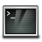

# Virtual Desktop

On UCloud it is possible to run web-based desktop applications. These software applications are installed in a virtual desktop environment (VDE) based on a Linux distributions, namely [AlmaLinux](almalinux.md), [CentOS](centos.md) and [Ubuntu](ubuntu.md).
Examples of software applications with a graphical user interface (GUI) deployed in a VDE include: [ANSYS](ansys.md), [COMSOL](comsol.md), [MATLAB](matlab.md), and [KNIME](knime.md).

::: {note}

In some of the VDE apps the software GUI is launched at the startup, while closing the GUI also terminates the job.

:::

In order to launch a VDE app, the user should follow the same procedure depicted in the previous section for [interactive apps](interactive_apps.md).
In this case, however, by clicking on

{{ btn_open_interface }}

a remote desktop is opened inside a pop-up window, which can be arbitrarily resized.

Additional features of VDE apps are summarized below.

## Web browsers

<a style="pointer-events: none"> </a>

Direct access to internet is provided by the Chromium and Firefox web browsers.

## Remote filesystem

<a style="pointer-events: none"></a>

The remote filesystem of the application container can be browsed via the Linux filemanager. In case data folders are mounted from UCloud, they will appear within the `/work` directory, which is the *default working tree* of the application container.

::: {important}

Only new files and folders created inside the *default working tree* will be saved after job completion.

:::

## Terminal window

<a style="pointer-events: none"></a>

Access to a shell window is provided by the *Terminal* application on the desktop. The startup directory in this case is always `/work`.
The default user inside the application container is `ucloud`, which has also superuser account privileges. Therefore, full read, write, and execute permissions are enabled using `sudo` in front of any command, without entering an administrator password. Before installing a new software, it is recommended to update the system libraries. For this purpose, run the command

```console
$ sudo yum update
```

for a *CentOS-based* app, and

```console
$ sudo apt-get update
```

in case of an *Ubuntu-based* app.

## Display resolution

<a style="pointer-events: none"></a>

The desktop resolution can be changed using the _Display_ application installed in the operative system.

Custom display resolutions can be added from the terminal window. For example, for a screen of 2560x1440 pixels at 60 Hz, first run the command

```console
$ cvt 2560 1440 60
```

::: {tip}

\# 2560x1440 59.96 Hz (CVT 3.69M9) hsync: 89.52 kHz; pclk: 312.25 MHz

Modeline "2560x1440_60.00"  312.25  2560 2752 3024 3488  1440 1443 1448 1493 -hsync +vsync

:::

then, create the new display mode using the second line in the output, as shown below:

```console
$ xrandr --newmode "2560x1440_60.00"  312.25  2560 2752 3024 3488  1440 1443 1448 1493 -hsync +vsync
```

and

```console
$ xrandr --addmode VNC-0 2560x1440_60.00
```

The new resolution can be selected directly from the _Display_ application or via command line:

```console
$ xrandr --output VNC-0 --mode 2560x1440_60.00
```
