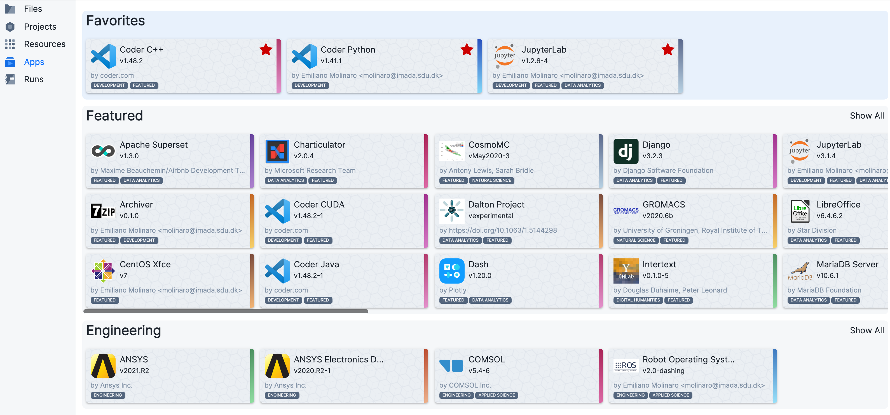

# Select an App

From the *Apps* section of the [side menu](navigation-menu.md) the user is able to access a catalogue of selected applications, grouped in different cards, as shown below. The full list of supported apps available on UCloud is reported [here](../Apps/apps_index.md).
 

 

On the top of this page the user can see all the apps marked as _favorites_. An app can be added to this list for easy access in the future, by hovering on the app card and clicking on the small red bookmark on the top-right corner.

In the *Featured* list the user can find a selection of frequently used interactive applications.

Other cards are organized in categories and application tools. By clicking on *show all*, the user can access the complete list of items belonging to the same category/tool.

:::{note}

Every app belongs to one or more categories, which are highlighted with a tag at the bottom of the app card or tool block.
The complete list of tags, together with the corresponding apps, is reported [here](../Apps/tags.md).

:::
