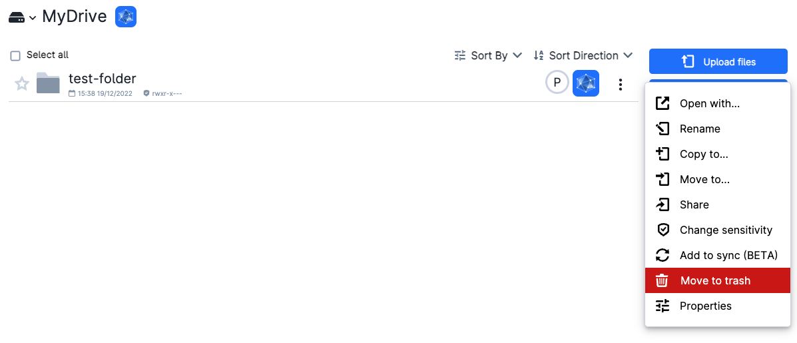
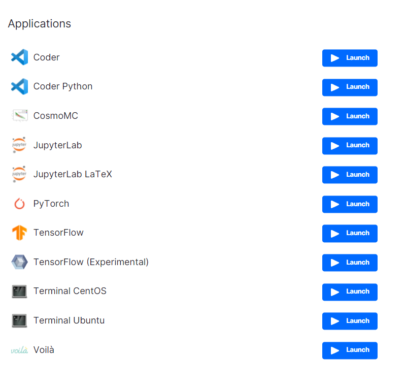
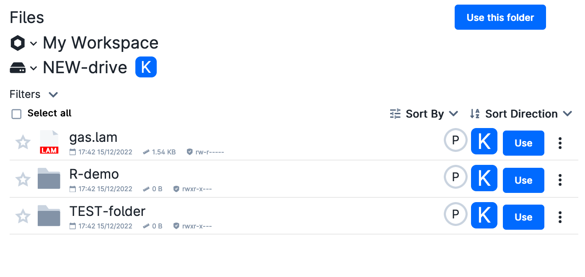

# Manage Files and Folders

If a file or folder icon is selected, different options are shown to the user on the right side of the screen, as in the figure below.
 

 

These options include: *Open with...*, *Rename*, *Download*, *Copy to...*, *Move to...*, *Move to trash*, *Change sensitivity*, and *Properties*. Some of these operations may also be applied to multiple files/folders simultaneously.
In the case of a single file or folder, the same options are accessible by clicking on the drop-down menu <object style="font-size:30px;font-weight:700;">&#x22EE;</object> on the right side, or right-clicking the file.

:::{note}

The list of available options may depend on the [active workspace](navigation-topbar.md), the sensitivity level, the number of selected items, the custom permissions assigned to the item, and wether the selected item is a file or a folder.

:::

## Open with...

{{ open_icon }}

By selecting this option, the user can open a file with a selected application, e.g. in case of a Python file, the resulting dialog box will look something like:
 

 

:::{note}

In this case the job is submitted with the default app parameters, using the smallest machine type in the backend.

:::

## Rename

{{ rename_icon }}

The user can rename files or folder by clicking this option.

(copy_and_move)=
## Copy to... and Move to...

{{ copy_icon }} &nbsp; {{ move_icon }}

The user can copy and move files either within the default personal workspace or within any [project workspace](project-intro.md) that the user is a member of.
The destination path can be selected using the dialog box that will popup:
 

 
Different drives can be selected by clicking on the down arrow next to the drive icon.

:::{note}

These operations are allowed within a single drive type.

:::

## Download

{{ download_icon }}

To download a file, the user can click *Download*.
Folders cannot be downloaded and should be archived using the [Archiver](../Apps/archiver.md) application before downloading.

## Change Sensitivity

{{ sensitivity_icon }}

The *Change sensitivity* field allows to specify the sensitivity level of the selected file or folder, which is marked with a capital letter on the right side.

UCloud operates with four levels of file classification:

* **Inherit**: Files inherit the classification of the parent folder.

* **Private (P)**: Files that are freely available to external parties without requiring confidentiality agreements (default level).

* **Confidential (C)**: Information that is important to the core business/project; high availability and high integrity are critical, regardless of the level of confidentiality required.

* **Sensitive (S)**: Data related to an individual, e.g. a customer, a citizen, a patient or an employee; files and folders with this sensitivity level _cannot be downloaded_.

When a new file is uploaded to UCloud, it automatically inherits the sensitivity level of the current folder, unless otherwise specified.

## Properties

{{ properties_icon }}

The *Properties* option shows the metadata associated with the selected file or folder, which includes date of creation, sensitivity level, and, possibly, the list of users sharing the same file.
Depending on the file type a preview of the file will also be shown.

## Move to Trash

{{ trash_icon }}

When files are deleted, they are not actually removed from the platform. In order to permanently delete them, the user  should navigate into the `Trash` folder. Here the user will be able to empty the folder and thereby permanently delete files and folders.

It is recommended to empty the ``Trash`` folder periodically to avoid using storage resources.

:::{danger}

Deleted drives are permanently removed, and cannot be restored from the ``Trash`` folder.

:::
