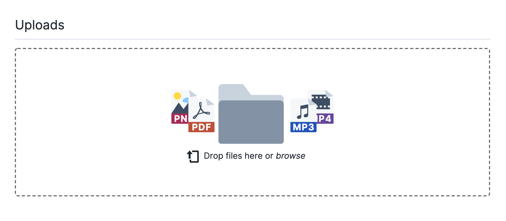

# Add Files and Folders

The *Files* section of the UCloud [side menu](navigation-menu.md) is used to access the data stored within the active workspace.
From this page the different drives associated with the active workspace and specific provider can be accessed.
In addition more drives on the **DeiC interactive HPC (SDU)** system can be created.

Once connected to a provider, the corresponding drive will be created and marked with a symbol at the right side of the drive line.

Files and folders can be accessed by entering the drives. From here files can be uploaded, folders can be created, and files/folders can be moved around, within the same provider drive.

The page of a drive should look something like this:

Display of hidden files (like e.g. dotfiles) can be avoided by clicking on the switch on the right side
of the folder list.

::: {important}

File management is possible inside each single provider drive, namely it is not allowed to move or copy files among different provider drives.

:::

## Create new folders

On the top-right side of the *Files* section after selecting a drive, the user has the possibility to create a new folder.
By clicking on

{{ btn_create_folder }}

a new directory appears and a name can be assigned to it.

## Upload files

On the top-right side of the *Files* section after selecting a drive, the user has the possibility to upload files. By clicking on

{{ btn_upload_files }}

the user will be prompted to the dialog box:

The user can either drag-and-drop files or click the dialog box to search for files locally. The file uploading can be paused and resumed through the menu on the right side of the file name

New files will be saved in the selected UCloud directory.
Information about the creation and modification dates is written below each file and folder. In addition, for each file it is reported the corresponding size.

## Add to favorites

It is also possible from this page to tag a file or a folders as *favorite*, by hovering on it and clicking the {{ star_empty_icon }} symbol next to its name. Favorite items are marked with the {{ star_full_blue_icon }} symbol and are also shown in the [central dashboard](navigation-dash.md#favorites).
