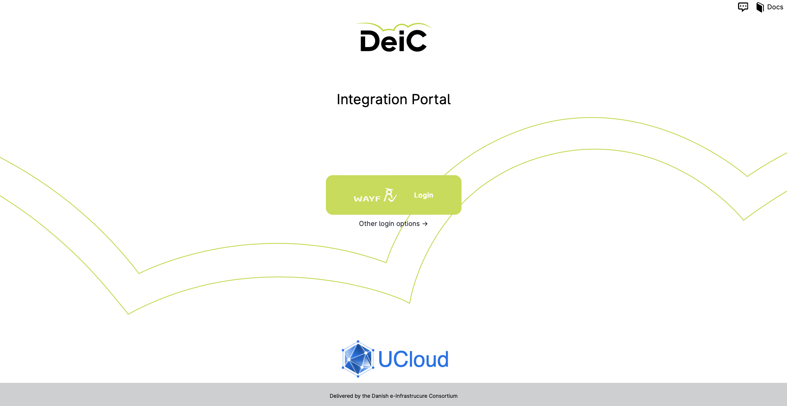

# Login

UCloud can be accessed via the URL: [https://cloud.sdu.dk/](https://cloud.sdu.dk/).
 

 

To access the platform you need to click on the _WAYF_ (_Where Are You From_) button. This allows any user affiliated with a Danish educational institution to access the platform without a separate account. All they need is the username and password that they use in their institution.

The SDU eScience [terms of service](https://legal.cloud.sdu.dk/) must be approved upon first access. Afterwards, the user is redirected to the UCloud [user interface](navigation-intro.md).

:::{note}

Once logged in, the user has the option to set up [two factor authentication](navigation-topbar.md#two-factor-authentication) by clicking on the avatar icon in the upper right corner of the home screen.

:::
