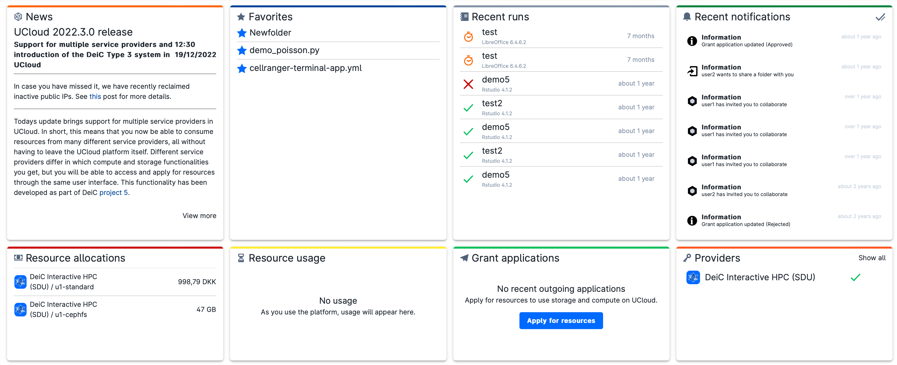

# Central Dashboard

The central dashboard consists of eight panels, which provide a broad summary of the user's activities within the active workspace. Each panel shows the most recent updates. The full list is obtained by clicking on the panel title.
 

 
The function of each panel is explained below.

## News

{{ news_icon }}

In *News* the user can find updates about UCloud maintenance and new features added.

## Favorites

{{ star_full_grey_icon }}

In *Favorites* the user can easily search for files and folders tagged as *favorites*, which may be used several times for different purposes.

## Recent runs

{{ recent_runs_icon }}

In *Recent runs* there are links to jobs recently executed. These can be marked as: *success* {{ success_icon }}, *failure* {{ failure_icon }}, *running* {{ running_icon }}, or *expired* {{ expired_icon }}. By clicking on the run name, the user can access the progress view of that specific job as well as the job results (see the section [Submit a Job](submitting.md) for details).

## Recent notifications

{{ bell_grey_icon }}

This panel reports the most recent notifications received by the user. Unread notifications are always highlighted. In case of notifications of data sharing, it is possible to access the shared file or folder by clicking on the listed item (see also the section [Share Folders](sharing.md)).
Using the checkmark in the upper right corner, the user can mark all the notifications as "read".

(resource_allocations)=
## Resource allocations

{{ resources_icon }}

This panel shows a summary of the credit available for storage and compute resources in the active workspace, broken down by [products](resources-products.md). The icon corresponding to the specific [provider](providers.md) is shown on the left side of each item. A detailed view of product allocations and sub-allocations, including public IPs and licenses, is displayed by inspecting on the panel title.

## Resource usage

{{ usage_icon }}

From this panel, the user gets an overview of the total credit used for storage and compute resources in the last thirty days.
By clicking on the panel title, a detailed view of the usage of each resource (computing, storage, public link, public IP and licenses) is displayed.

## Providers

{{ providers_icon }}

The *Providers* panel lists the [providers](providers.md) for which the user has available resources.
Except for **DeiC interactive HPC**, it is necessary to connect to the specific provider with the button

{{ btn_connect }}

on the right side of each item of the list.
This step is required to use the corresponding granted resources, from the UCloud interface.

By clicking on *Show all*, on the top-right side of the panel,
it is possible to access the list of providers available through UCloud and detailed information on each of them.

## Grant applications

{{ grant_application_icon }}

In *Grant applications* it is reported the status of the status of the latest requests for additional resources on a specific provider, whether they are requested for the user personal workspace, or for a new/existing project. By clicking on the items in the list it is possible to retrieve the submitted grant application form. Each item is marked as: *approved* {{ success_icon }}, *rejected* {{ failure_icon }}, or *pending* {{ pending_icon }}.

From here the user can initiate a [grant application](resources-grant.md) clicking on

{{ btn_apply_for_resources }}

See the [Project Workspace](project-intro.md) section for details.

:::{note}

Once the application has been approved, depending on the selected provider, specific procedures may be necessary to connect to the HPC system and start using the available resources.

:::
