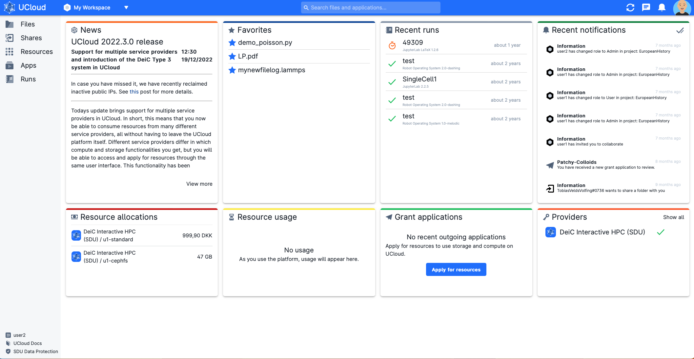

# User Interface

The UCloud user interface contains a [top navigation bar](navigation-topbar.md), a [side menu](navigation-menu.md) and a [central dashboard](navigation-dash.md).
The home screen looks like this:
<br>



<br>
No matter where the user navigates in the platform, the top navigation bar and the side menu are always visible on the screen.

```{eval-rst}
.. raw:: html

    <h2>Contents</h2>

.. toctree::
   :maxdepth: 3

   navigation-topbar
   navigation-menu
   navigation-dash
```
