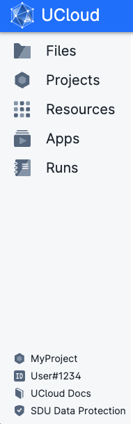
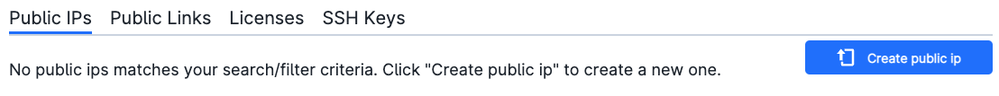

# Side Menu

The navigation menu is located on the left side of the UCloud interface.

Within the default user workspace it looks like the figure below.

 

 
 

From the side menu it is possible to access the five main components of UCloud:

* **Files**, to explore the filesystem of the selected project in the top menu.
* **Projects**, to see details about active project workspaces.
* **Shares**, to explore files in the user personal workspace (*My Workspace*) that have been shared with/by other users.
* **Resources**, to explore which *active* resource (Public IPs, Public Links, Licenses) is available in the selected workspace and upload user's SSH public keys:
 

* **Apps**, to browse all the available applications and add them to a favorite list for easy access.
* **Runs**, to show the results from completed jobs and runs in progress. From here it is also possible to cancel jobs.

The user {{ ID_icon }} is shown on the lower left side of the page. Below is a link to the UCloud documentation and a link to  the description of the [data protection](https://www.sdu.dk/en/om_sdu/om_dette_websted/databeskyttelse) policy adopted by SDU eScience Center.
In addition, when a specific Project is selected, the path to the corresponding workspace appears above the user {{ ID_icon }}.

:::{note}

If the browser is open in a small window or on a smaller screen, such as a mobile phone or a tablet, the side menu will collapse, but it can still be unfolded by hovering on it.

:::
