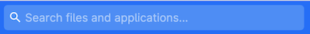
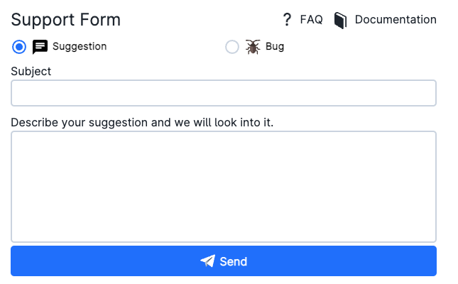
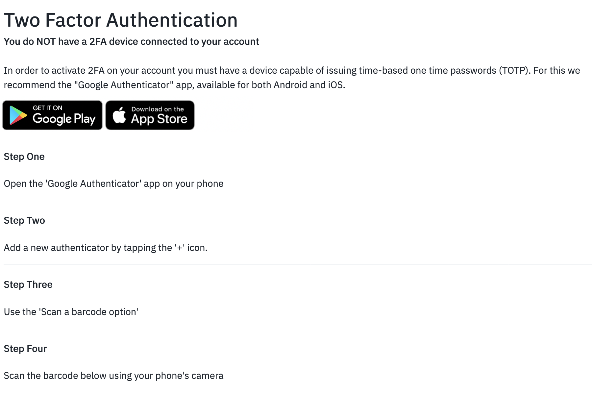

# Top Navigation Bar

The top navigation bar consists of several parts, which are summarized below.

## Workspace selector

The name of the user active workspace is shown on the left side of the navigation bar. By default, this corresponds to the user _personal_ workspace:
 

 
 

By clicking on the UCloud logo on the top-left corner, the user is always redirected to the dashboard of the active workspace.

:::{note}

On UCloud it is possible to create and join a special type of workspace, called [project workspace](project-intro.md), intended for collaborative research and development.

:::

## Search box

In the middle of the navigation bar the user finds a *search box*.
 

 
 

The search function depends on the currently open UCloud page:

 - If on the *Files* main page the search function will search for the drive names. Inside drives/folders it will search for filenames.

- If on the *Shares* page the search function will search for files and applications.

- If on the *Resources* page the search function will look for public IPs, public links, software licenses or SSH keys, depending on currently selected tab.

- If on the *Apps* page the search function will search for applications.

- If on the *Runs* page the search function will look for submitted jobs.

## Settings and notifications

On the right side of the navigation bar the user finds four icons:

- The *refresh* icon {{ refresh_icon }} can be used to refresh the [central dashboard](navigation-dash.md).

- The *support-form* icon {{ support_form_icon }} allows users to send suggestions or report bugs.
 

- Through the *notification-service* icon {{ bell_icon }} the user will receive notifications, for example, when another user has shared a file, on the status of an application grant, etc.

- The _user avatar_ icon permits to check the [site status page](https://status.cloud.sdu.dk/), _log out_ from the platform, and change the _login settings_, namely: updating the password and setting a _two factor authentication_ method.

Finally, a temporary *alert* icon {{ alert_icon }} in the navigation bar will indicate upcoming downtime and scheduled maintenance.

:::{note}
A temporary *progress indicator* also appears in the top of the page while uploading, copying or removing a large number of files. By clicking on this icon, the user can monitor the status until the operation is completed.
:::

## Two factor authentication

It is possible to set up *two factor authentication* by clicking on the avatar icon and selecting the *settings* option. Once the button

{{ btn_start_setup }}

is pressed the user is guided step-by-step through the activation process.
 

