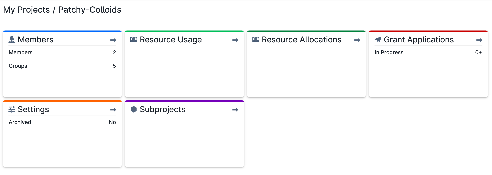
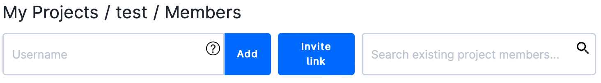
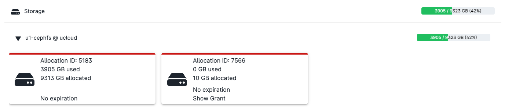
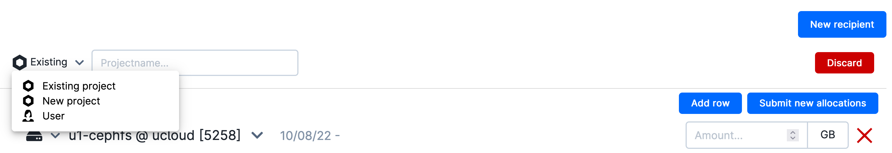
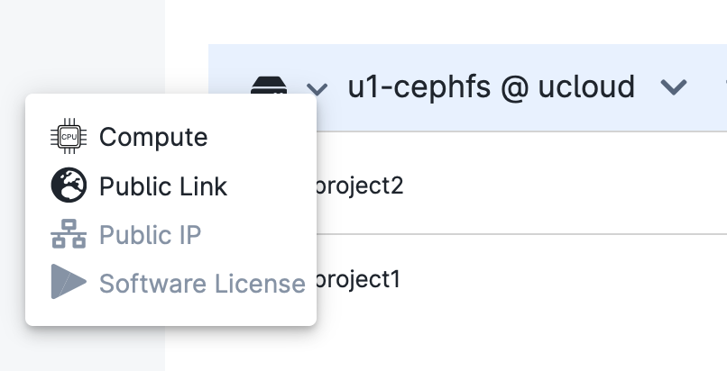
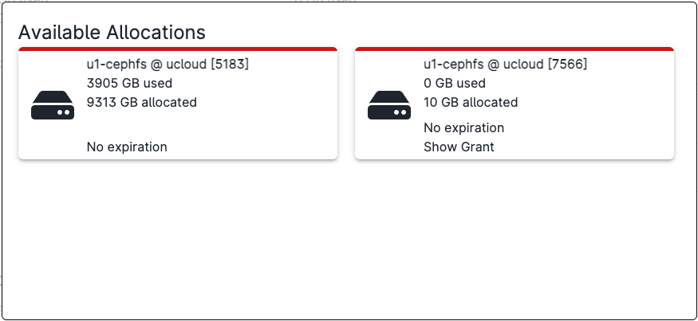
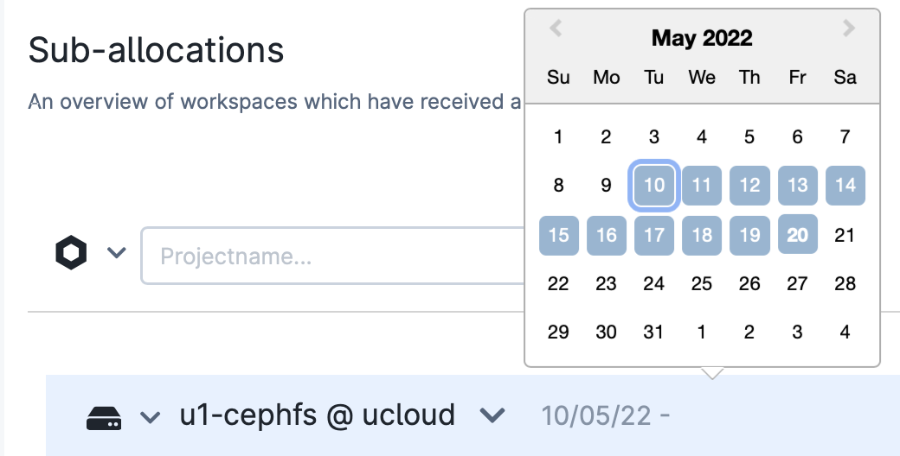
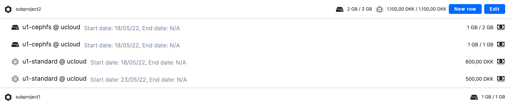

# Manage Projects

The project management page includes six information panels, similar to the ones showed below.
 

 
Only project admins have full access to all the panels.

## Members

{{ member_icon }}

From this panel it is possible to add new members and create groups.
Members can be added via their {{ ID_icon }}. In addition, users can be invited by sharing an *Invite link*.

 

 

The PI and project administrators can change the role of the other members.

## Resource Usage

{{ resources_icon }}

From this panel it is possible to get information on the resource usage.
Data can be filtered by usage periods and/or product type.
The same page can be accessed directly from the dashboard of the active project.

:::{note}

By default the data shown correspond to the usage in the last thirty days.

:::

## Resource Allocations

The resource allocations are divided in different categories, namely *Storage*, *Compute*, *Network ip* and *Software License*.
The product name can be  displayed by clicking on the resource category. In addition, by clicking on the product name, users can view the corresponding allocation code. For instance, by clicking on *Storage*
 

 
On the right side of the product type it is possible to see the sub-allocation usage in percent.

### Sub-allocations

From the *Resources Allocations* page admins can create new subproject allocations and organize resources among existing subprojects.

{{ btn_new_recipient }}

To create a new subproject the user must select *New Project* and write the name of the chosen project.

For an existing workspace, a new sub-allocation is created by selecting
*Existing project*   or  *User* as recipient  and adding the full *project path* or the *user* {{ ID_icon }}, respectively.
The latter are located at the bottom left side of the UCloud interface and can be copied by clicking on the selected string.
 

 

When *User* is selected, the resources will be available in the user personal workspace, *My Workspace*.

Multiple new rows (products) can be added by clicking on the subproject name.
On the one hand, the menu on the left side of the product name allows to change product type, depending on the resources available in the parent project
 

 

On the other hand, the menu at the right side allows to select the specific allocation
 

 

In the same row, by clicking on the date, the user can set the allocation period.
 

 

Once the required fields have been filled in, it is possible to allocate resources by clicking on the button

{{ btn_sub_new_allocations }}

The project PI will be prompted to a dialog box where a brief reason for the allocation should be given.

A new recipient can be removed before submission by clicking on the button

{{ btn_discard_red }}

The existing sub-allocations are listed at the bottom of the page. Storage and compute resources are reported as `(used) / (initial) ` balance.
For each item, the PI of the subproject is shown under the subproject name.
By clicking on the sub-allocation name it is possible to modify a product line or add a new line.
 

 

:::{note}
Resource overallocation is allowed in order to favor the efficient and complete use of the root project resources. PI should monitor that enough resources are available in the root project.
:::

## Grant Applications

{{ grant_application_icon }}

It shows the status of ingoing grant applications from subprojects.

## Settings

{{ settings_icon }}

This panel allows to access the project metadata and manage the project workspace.

## Subprojects

{{ subproject_icon }}

This panel is used to create new subprojects and/or list existing subprojects.

Only project admins can create subprojects, by clicking on

{{ btn_create_subproject }}

at the top right of the page.
Once subprojects are created, it is possible to redistribute the parent project resources as new isolated workspaces, from the _Resources and Usage_
panel.

A subproject can be selected also from the [workspace selector](navigation-topbar.md#workspace-selector) in the navigation bar.
The name of the parent project is highlighted in the [projects overview page](project-overview.md#projects-overview).

:::{note}
Grant applications submitted within a subproject workspace can be approved only by an admin of the parent project, who will receive a notification soon after the submission.
:::
