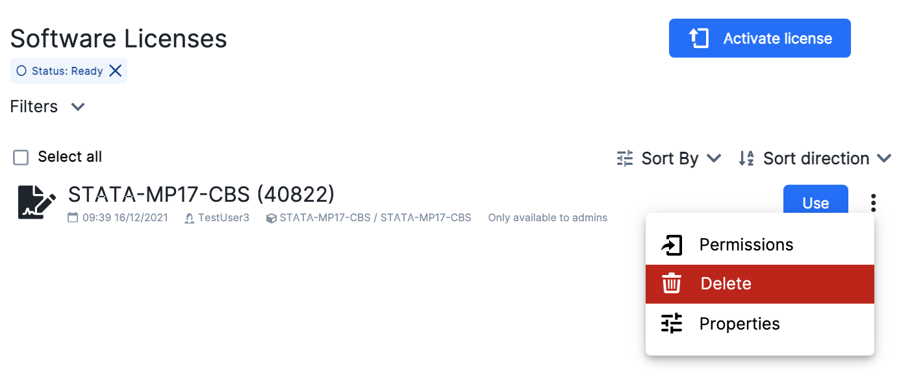

# Create Projects

To create a project workspace the user should fill in a [grant application form](resources-grant.md), which is accessible directly from the [central dashboard](resource_allocations). Alternatively, the user should move to the [projects overview page](#projects-overview), by selecting *manage projects* in the [workspace selector](navigation-topbar.md#workspace-selector). From here the user should click on

{{ btn_new_project_application }}

and follow the instructions.
In the application form one must specify the project name and the amount of resources to be allocated for each [product](resources-products.md). In addition, it is necessary to write a brief description of the project and its motivation, following the structure of the default template.

After the application is approved, the user can activate the workspace  by selecting the project name from the workspace selector. As a result, the central dashboard is automatically  updated with relevant information related to the project workspace.

::: {note}

The *Shares* section in the [side menu](navigation-menu.md) is replaced with a new one called *Projects*. This allows direct access to the projects overview page.

:::

## Projects overview

The projects overview page shows the list of all UCloud hosted projects that the user is a member of. This also includes workspaces owned by other users. Below each name in the list, users can see the parent project hierarchy. This page is structured similar to the figure below:
 

 

The active project workspace is marked with a green switch {{ switch_checked }}. Another project can be selected from here by clicking on the corresponding switch.
Projects can also be added to the *favorites* list by means of the {{ star_empty_icon }} symbol on the left.

The user can select one or multiple projects in the list and perform different operations, which are shown in the menu opened on the right side of the page. The same options are displayed in the drop-down menu <object style="font-size:30px;font-weight:700;">&#x22EE;</object> next to the project name. These actions are briefly discussed below.

### Archive a project

The project admin can archive the project workspace if it is no longer relevant for the day-to-day work. The project will be hidden for all the user members.

::: {note}

No data will be deleted and the action is reversible.

:::

All archived projects can be viewed by checking the box on the right side of the page. They are marked with the {{ project_archive_icon }} symbol.

### Leave a project

When a user member leaves a project, all files and compute resources of the project become inaccessible to this user. However, none of the user files inside the project workspace will be deleted. Project admins have access to the files stored in the personal folders of former project's members.

::: {note}

If the user is also the creator and owner of the project, he/she must transfer the ownership to another member before leaving the project.

:::

### Manage a project

This option gives access to the [project management page](project-management.md). The same page can be reached by clicking on the project name in the *projects overview* page or by selecting the option *manage active project* from the workspace selector.

## Member roles

A user member can have different roles within a project. The role is highlighted with a special icon next to the project name.

There are *three* types of membership within a UCloud project, which are briefly discussed below.

### Principal investigator

{{ PI_icon }}
 

When a project is created within UCloud a principal investigator (PI) is also created.  The PI is the user who started the project.

::: {note}

The PI role itself is indefinite and cannot be removed. There can be only one PI per project.

:::

The user's research institution may or may not have a set of rules with clear definitions of the PI role and the related security constraints. Nonetheless,
the PI of a UCloud project has the following *management tasks*:

- Add/remove members.
- Create groups.
- Change members role and file permissions.
- Restrict access to software licenses.
- Archive/unarchive a project.
- Create subprojects.
- Access and cancel jobs started by other members of the project.
- Apply for project resources.

Furthermore, the PI has the following *administrative tasks*:

- Administration of UCloud credits for the project.

- Administration of UCloud storage quotas for the project.

- Ensure the validity of the data management plan for the project.

- Ensure validity of the risk assessment for the project.

- Consent management.

Finally, the PI is encouraged to follow these *security best practices*:

- Monitor member behavior based on [UCloud terms](https://legal.cloud.sdu.dk/terms#customer-obligations) of service.

- Ensure the validity of the asset classification.

- Define the access control list (ACL) to each resource for members.

- Make sure members have sufficient knowledge of GDPR laws.

- Ensure that members have sufficient knowledge of cybersecurity policies at the research institution where the project itself has its administrative headquarters.

### Administrator

{{ admin_icon }}
 

Member of the project with the same privileges and tasks as the PI, that effectively acts _on behalf_ of the PI.

::: {note}

A project can have none or any number of administrators.

:::

### Default member

{{ user_icon }}
 

Member of a group that is allowed to use the project resources and access folders made accessible by the project admins, i.e. the PI and administrators.

## File management

When a project workspace is created, a drive named `Members' Files: userID`
(where userID is the specific {{ ID_icon }} of the user) is added by default, which collects the *personal folders* of the member of the project logged into UCloud.

The drives of all the members of the project are visible
to the project admins only by clicking the *Show member files* switch, on the right side of the page:
 

 

Running a job using the project's resources will make the job output folder appear in `Members' Files: userID`.

::: {important}

When a user leaves a project, they will no longer be able to access *any* files within the project workspace.

:::

### Create new folders

Whenever a new folder is created inside a project root directory, it can only be used by the project admins.
These can modify the folder permissions and allow access to selected groups of users.

### Import files

Users can copy and move files from their personal workspace to another path within a project workspace, provided they belong to a project group with *write* permission on that folder (check [here](copy_and_move)).
By default, a member of a project can add files in the project *personal folder*, that is `Members' Files: userID`.

## License management

Project admins can request access to a specific software license by submitting a grant application, the same way for any other [product](resources-products.md) available on UCloud.

In order to use the software license, it must first be activated directly from the [front-end page](submitting.md#setting-parameter-values) of the app, by using the parameter intended for the selection of the license server, as shown in this example:
 

 

Once activated, project admins can grant permission to various project groups to use the license. Permissions can also be updated later on by selecting _Properties_ in the drop-down menu <object style="font-size:30px;font-weight:700;">&#x22EE;</object> beside the license name:
 

 

Conversely, by clicking on
 

{{ btn_delete }}

 
 

the software license will be deactivated and it cannot be used anymore by any member of the project. However, project admins can always reactivate the license at any moment, by repeating the procedure described above.
