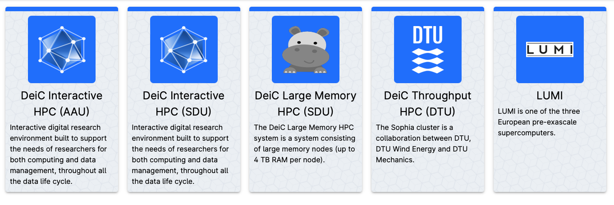
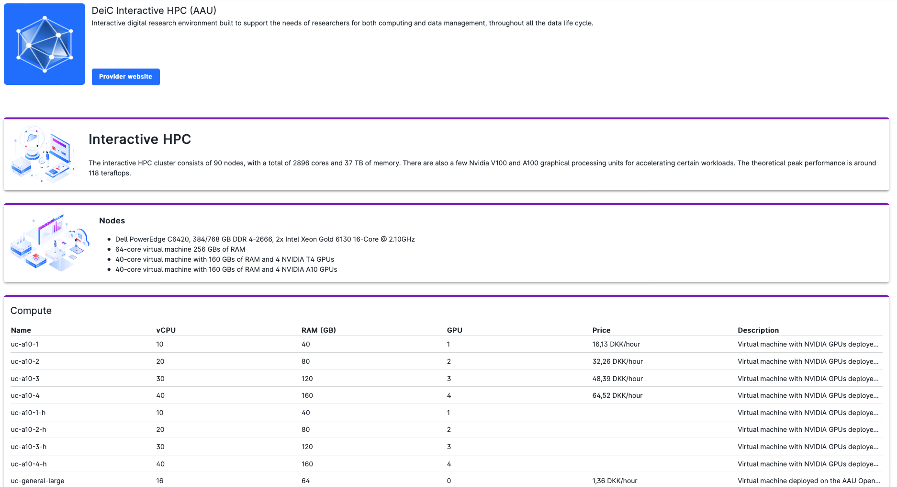

# Providers

UCloud is a platform which connects users to service providers. These are [national HPC facilities](https://www.deic.dk/en/supercomputing/national-hpc-facilities) accessible through the UCloud interface.

The full list of providers can be accessed via the [central dashboard](navigation-dash.md#grant-applications) by clicking on the *Show all* button in the upper right side of the *Providers* panel.

 

By clicking on each panel, it is possible to have detailed information about the provider, including website/documentation link and available compute resources, e.g. in the case of **DeiC Interactive HPC (AAU)**:

 

When someone logs into UCloud for the first time, a bonus gift in terms of storage space and compute node-hours on **DeiC interactive HPC (SDU)** is automatically awarded to the user's personal workspace.

The user may request additional resources at any time by submitting a [grant application](resources-grant.md) via the UCloud interface.

::: {note}

The personal workspace is suitable only for small projects which do not require heavy computational resources and enhanced collaboration capabilities.

:::
