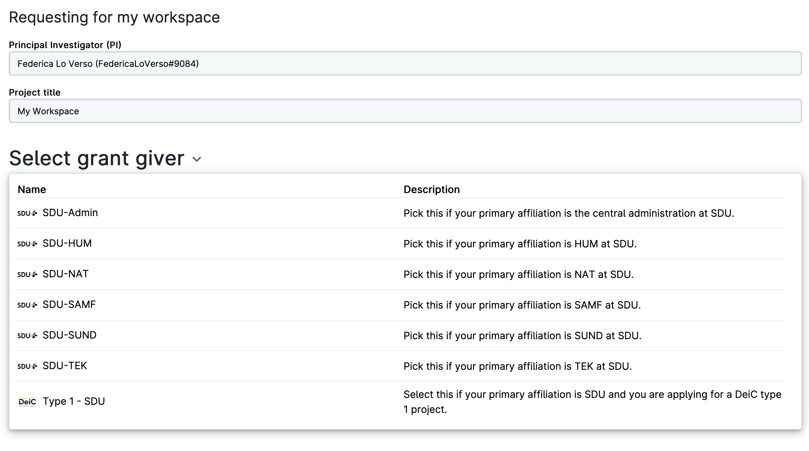

# Grant Application

The user should submit a grant application to demand for additional resources. This procedure can be initiated directly from the [dashboard](navigation-dash.md#grant-applications).

As a first step to adding more credit to the personal workspace, the user needs to select a *grant giver* from the list provided by the user's affiliation/institution. For example:

Each grant giver is responsible for allocating resources on a specific [provider](providers.md).

From the same page it is possible to apply for a new project, by clicking on the blue button

{{ btn_apply_for_newproj }}

at the top right of the page.

## Fill in and submit

After selecting the *grant giver*, the user must specify the amount of resources to be allocated for each [product](resources-products.md), and write the purpose of the application, following the schema provided in the template.

::: {note}

Several *providers* can be selected in the same application form.

:::

Finally, the user must press the button

{{ btn_submit_application }}

at the top right of the page to send the request.

::: {note}

The grant application will be reviewed by an internal committee, one for each provider included in the application. Once the project is approved, a notification will be sent to the user.

:::

## Check the status

The user can check the status of the application directly from the [grant application panel](navigation-dash.md#grant-applications) in the central dashboard.

By clicking on the name of the application it is possible to retrieve the submitted form, from which the user can exchange messages with the administrator in charge of the review process.
