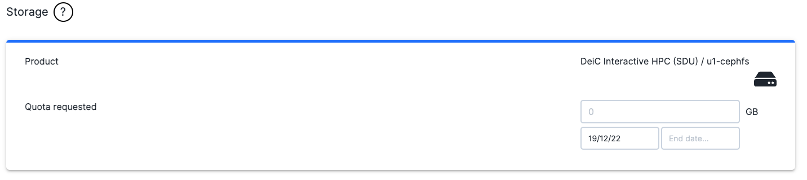
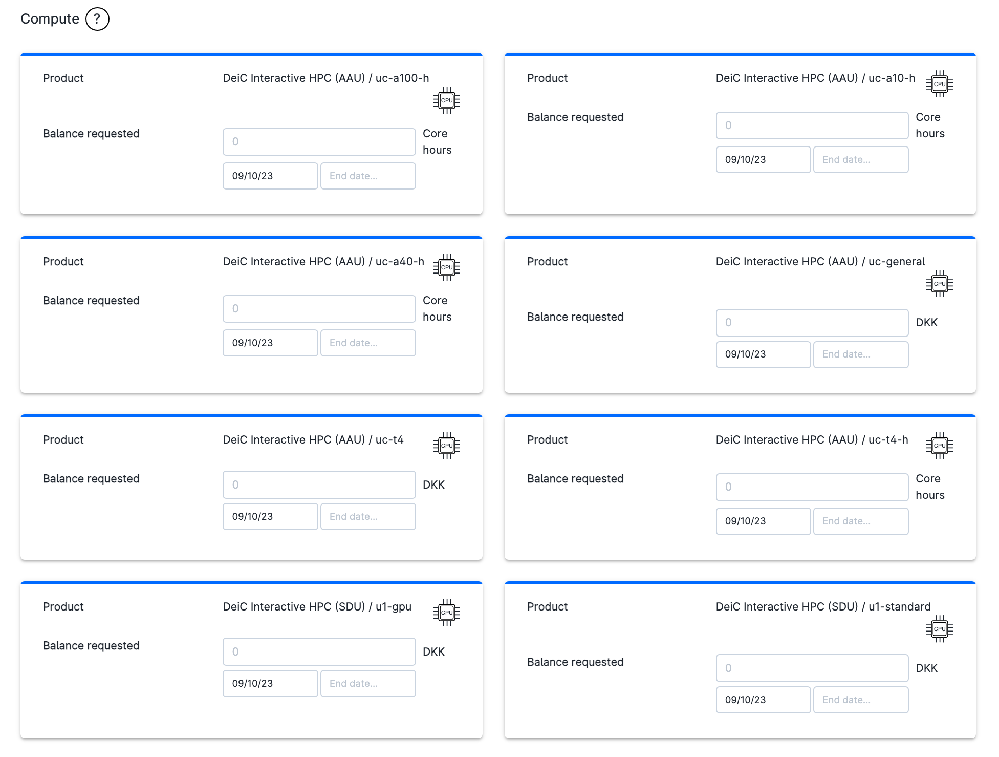
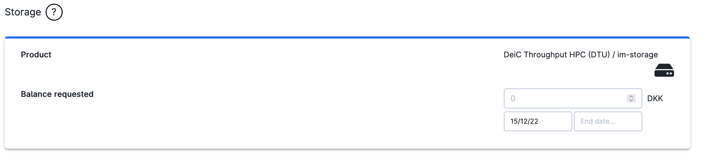
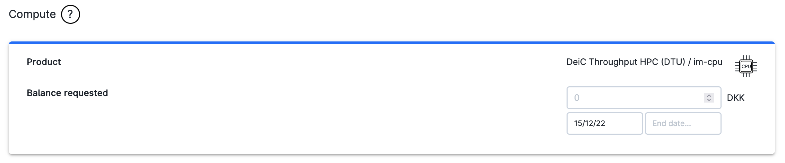
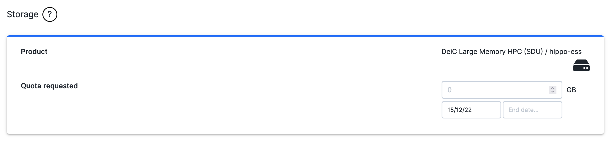
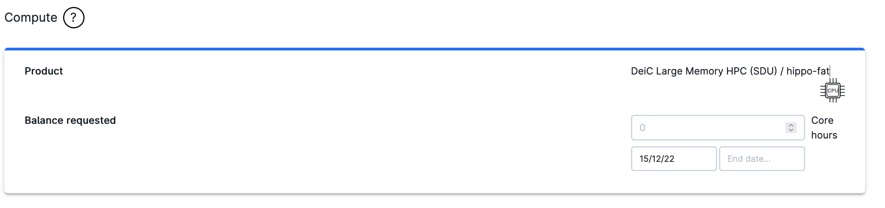

# Products

For each *grant giver*, the application form is divided in multiple panels, each one associated with a specific product.

The products are in turn grouped according to the available resource category for each provider. Within each panel it is possible to request credit for a particular product.

Information including remaining resources and allocation time can be found in the [Resources and Usage](project-management.md#resource-usage) page.

::: {note}

The updated cost of each product is reported [here](https://cloud.sdu.dk/app/skus).

:::

##  DeiC interactive HPC (AAU, SDU)

### Storage

The storage service includes one product:

- Ceph File System: `u1-cephfs`.

The overall amount of resources for this product must be specified in the dialog box below.
 

 

The user must fill in the *storage quota* (in GB).

Data can be stored for a period of time at least as long as the allocation grant period.

### Compute

The user can choose four different products from the UCloud compute service, each one partitioned in several [machine types](../Apps/general_settings.md#machine-type):

- UCloud standard nodes: `u1-standard`
  > A standard node consists of 2x Intel(R) Xeon(R) Gold 6130 CPU\@2.10 GHz, 32 vCPUs, and 384 GB of memory.

- UCloud fat nodes: `u1-fat`
  > A fat node consists of 2x Intel(R) Xeon(R) Gold 6130 CPU\@2.10 GHz, 32 vCPUs, and 768 GB of memory.

- UCloud GPU nodes: `u1-gpu`
  > A GPU node consists of 2x Intel(R) Xeon(R) Gold 6230 CPU\@2.10GHz, 40 vCPUs, and 192 GB of memory; 4x NVIDIA Tesla V100 SXM2 Volta GPUs Accelerators 32GB (NVLink).

- UCloud GPU nodes: `u2-gpu`
  > A GPU node consists of 2x AMD EPYC 7F72 CPU\@3.2GHz, 48 vCPUs, and 2048 GB of memory; 8x NVIDIA Tesla A100 PCIe GPUs Accelerators 40 GB.

- AAU general nodes: `uc-general`
  > Virtual machine deployed on the AAU OpenStack system.

- AAU GPU nodes: `uc-a10`

  > Virtual machine with NVIDIA A10 GPUs deployed on the AAU OpenStack system.

- AAU GPU nodes: `uc-a40`

  > Virtual machine with NVIDIA A40 GPUs deployed on the AAU OpenStack system.

- AAU GPU nodes: `uc-a100`

  > Virtual machine with NVIDIA A100 GPUs deployed on the AAU OpenStack system.

- AAU GPU nodes: `uc-t4`

  > Virtual machine with NVIDIA T4 GPUs deployed on the AAU OpenStack system.

 

 

For each product the user must specify the total amount of credit (in Core hours), as shown in the figure above.

Compute resources are used any time [a job is submitted](submitting.md). The resource balance is updated while the job is running and after job completion.

### Public IPs

UCloud apps can be deployed with a static [public IP address](../Apps/general_settings.md#attach-public-ip-addresses) to enable access by external third-party applications.

::: {note}

This feature is only available on a limited set of applications. We may also release any allocated IPs if they are not used for a sufficiently long period of time.

:::

### Licenses

Depending on the *grant giver*, it is also possible to apply for specific software licenses within a project. Software licenses are listed in the *Resource Allocations* panel of the [project dashboard](resource_allocations), similarly to the other products.

::: {note}

Access to the license server is controlled by the project admins, as described [here](project-overview.md#license-management).

:::

<!-- ##  DeiC Throughput HPC (DTU)

### Storage

The storage service includes one product:

- File System: `im-storage`.

The overall amount of resources for this product must be specified in the dialog box below.
 

 

The user must fill in the *storage quota* (in DKK).

Data can be stored for a period of time at least as long as the allocation grant period.

### Compute

The user can choose the following products:

- standard nodes: `im-cpu`
  > A node consists 2 x AMD 7351 CPUs, 16 cores/CPU and 128 GB memory

- fat nodes: `?`
  > A node consists of 2 x AMD 7351 CPUs, 16 cores/CPU and 256 GB of memory

The user must specify the total amount of credit (in DKK), as shown in the figure above.
 -->
##  DeiC Large Memory HPC (SDU)

### Storage

The storage service includes one product:

- File System: `hippo-ess`.

The overall amount of resources for this product must be specified in the dialog box below.
 

 

The user must fill in the *storage quota* (in GB).

Data can be stored for a period of time at least as long as the allocation grant period.

### Compute

The user can choose two different products:

- `hippo-hm1`
  > A node consists of 2x AMD EPYC 7742 CPU\@2.25Ghz, 64-Core and 480 GB SSD.

- `hippo-hm2`
  > A node consists of 2x AMD EPYC 7713 CPU\@2.0Ghz, 64-Core and 480 GB SSD.

The user must specify the total amount of credit (in Core hours), as shown in the figure above.
