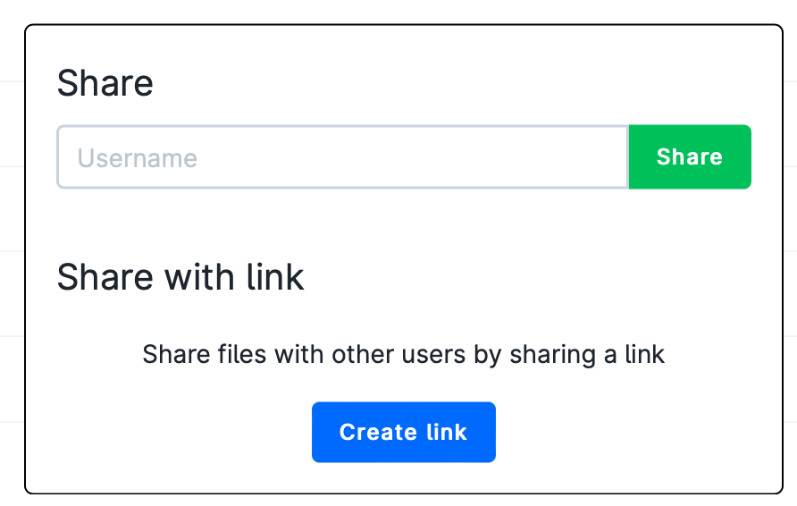
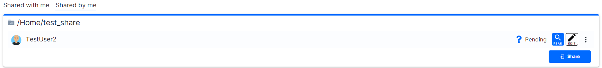

# Share Folders

Within the user personal workspace, i.e. _My Workspace_, it is possible to share folders with other users.

From the *Files* section of the side menu, the user should mark the folder, select the *Share* option and either write the {{ ID_icon }} of the collaborator or create a link which can be shared with several UCloud users.



```{note}
If not already logged in, while clicking on the received link, the collaborator  will be first redirected to the UCloud login page.
After that she/he will be able to accept the shared folder.
````

The collection of shared folders is displayed by the *Shares* section in the [side menu](navigation-menu.md).

<br>



<br>

In the *Shared by Me* panel, the user can change the collaborators permissions, revoke the access to the folder and share the folder with other users.  In the *Shared with Me* panel, the user can reject previously accepted shares.
Folders shared by collaborators with the user are also accessible from the *Files* section of the side menu.

If editing permissions have been granted, additional files can be uploaded inside the shared folder.

::: {note}

The sharing functionality is only available to the **DeiC interactive HPC (SDU)** provider from the user's personal workspace (*My Workspace*).
:::
