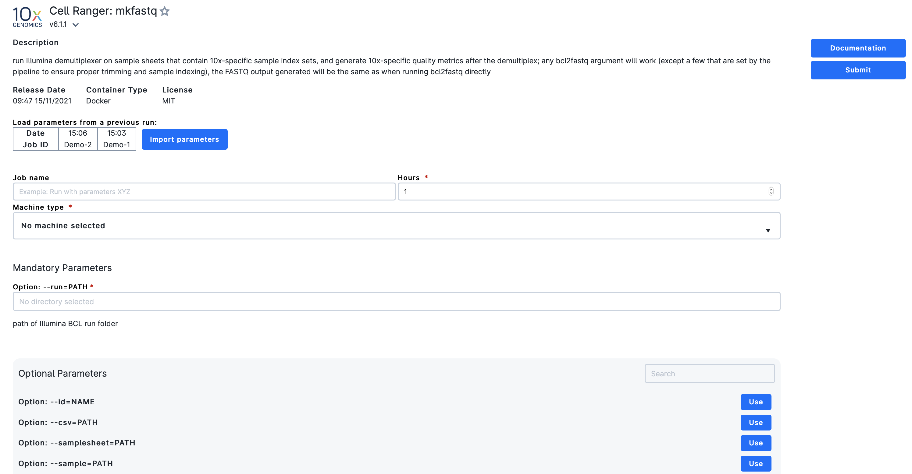
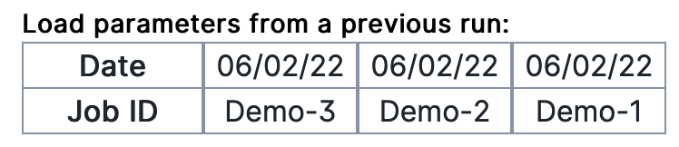
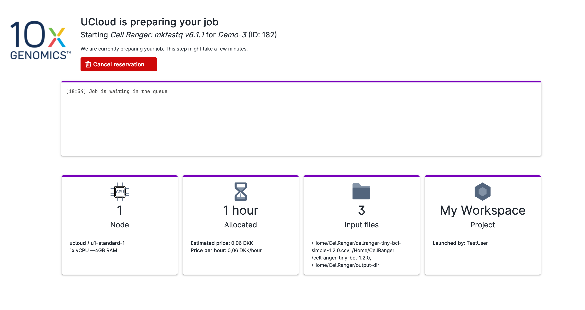
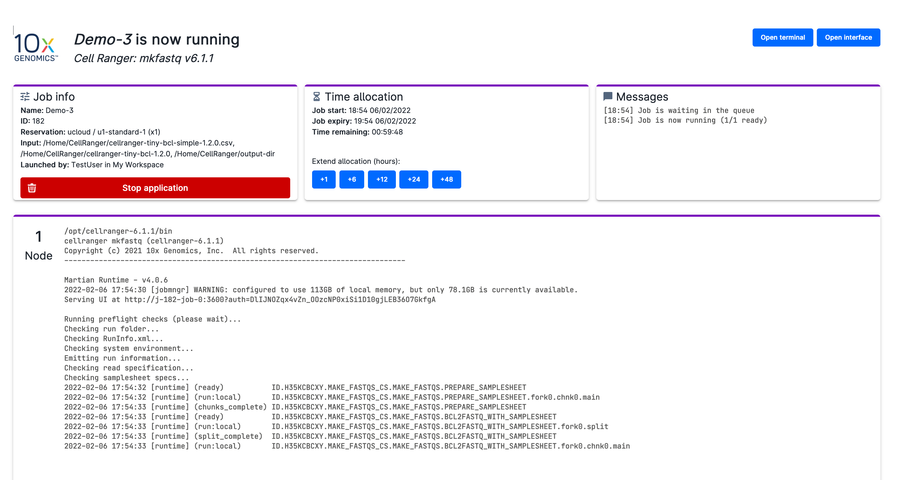
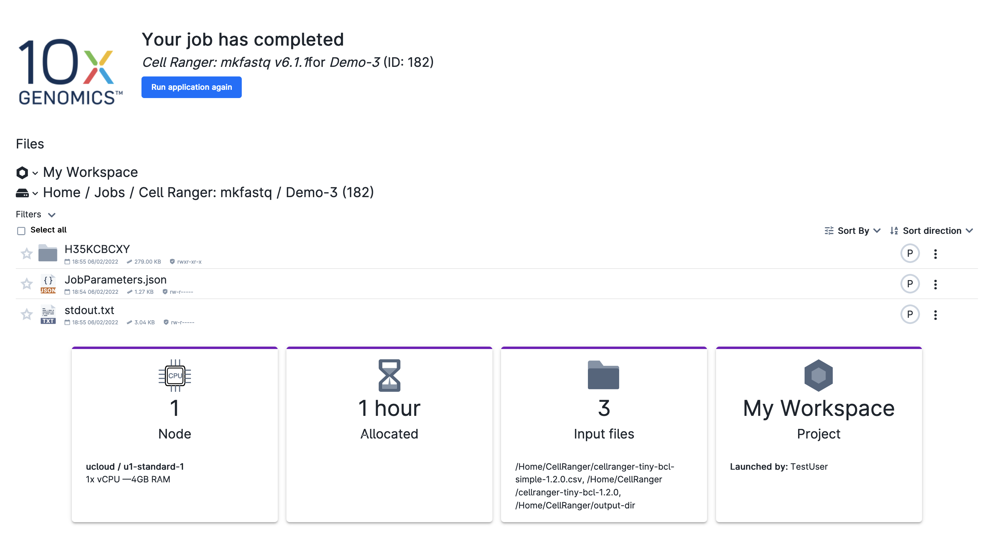

# Submit a Job

In order to submit a job on UCloud, the user should click on the application card and set the necessary job parameters.

## Setting parameter values

By clicking on the app card, the user access the app front-end page, which includes a basic description of the application and several parameters fields to configure/identify the job.

An example is shown below:
 

 

Every app is typically configured to run with a given set of options.
Mandatory arguments, which are always marked with a &ast;, must be provided before starting the job. On the other hand, optional parameters can be specified by clicking on

{{ btn_use }}

The available options depend on the specific app.

From the same window it is possible to assign a name to the job, set the time limit, and specify a machine type, along with other [general settings](../Apps/general_settings.md).

When the machine type is selected, the cost of the run is shown on the right of the page. If the active workspace has enough credit to run this job, the user can proceed with the job submission by clicking on

{{ btn_submit }}

Conversely, a warning message is shown together with a button to apply for additional resources.

From the app front-end page the user can also:

* Add the application to the *favorites* by clicking on the star at the left side of the app name.

* Access the app documentation page by clicking on the button:

  {{ btn_documentation }}

* [Load job parameters](#load-parameter-values) from a previous run.

* Select the app release by clicking on the drop-down menu at the right side of the app version.

::: {note}

A latest version of the selected application, when available, is highlighted at the top of the page, on the side of the app name.

:::

## Load parameter values

Parameter values from the most recent runs can be imported by clicking on the corresponding job name at the top of the page
 

 

In addition, by clicking on the button

{{ btn_import_parameters }}

different options for importing the parameters can be selected.
 

## Monitoring jobs

After the submission, the user is redirected to the job _progress view_.

This page summarizes information on the job status, allocated resources, mounted data volumes and workspace. The same page is also accessible from the the *Runs* section of the [side menu](./navigation-menu.md), by clicking on the job name.

### Job scheduled

While the job is still in the queue, none of the allocated computational resources is used. The _progress view_ in this case looks like the image below:
 

 

The user can remove the job from the queue before the run starts by clicking on

{{ btn_cancel_reservation }}

### Job running

After the job status is set to *running*, the _progress view_ is split into multiple panels, as shown here:
 

 

From each panel the user can perform different operations. For example, it is possible to terminate the job before the time limit is passed, using the button

{{ btn_stop_application }}

in the *job info* panel. Similarly, the user can arbitrarily extend the job lifetime at any moment by selecting a certain amount of hours from the *time allocation* panel.

Finally, while the job is running, the user can open a _terminal interface_ to get access inside the app, by clicking on

{{ btn_open_terminal }}

Depending on the [app type](../Apps/type.md), it is also possible to open a custom software graphical interface.

::: {important}

UCloud performs accounting at regular intervals during the job lifetime. Jobs will be terminated if the user runs out of credits before job completion.

:::

### Job completed

Once the job is completed, the path to the job output folder, with the associated link,
and the application results will be available in the _progress view_:
 

 

The job output folder will be reachable in the directory `Jobs`.

In addition, two files are generated:

* `stdout.txt`
* `JobParameters.json`

The first file reproduces the program standard output. This is useful for debugging in the case of a *failure* {{ failure_icon }} run.
The second file contains a record of the parameter values used to submit the job.
This is written in JSON format (check [here](../Apps/batch_apps.md) for an explicit example).

The JSON configuration file is used to [load all job's options](#load-parameter-values) at the same time.

From this page, it is also possible to start a new job by clicking on

{{ btn_run_application_again }}
