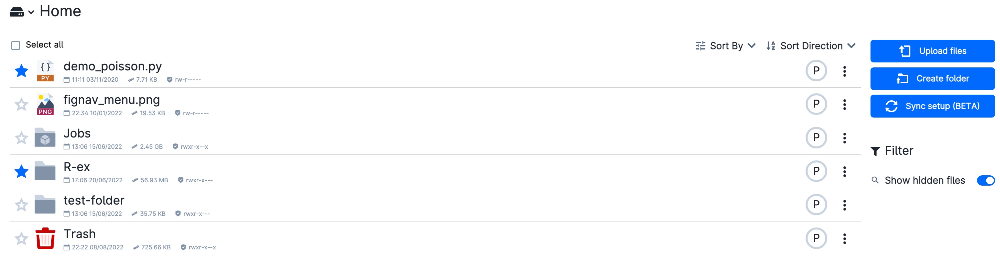
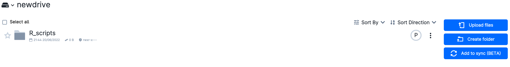
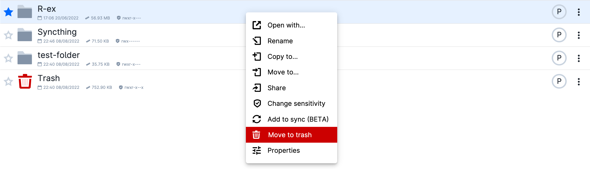
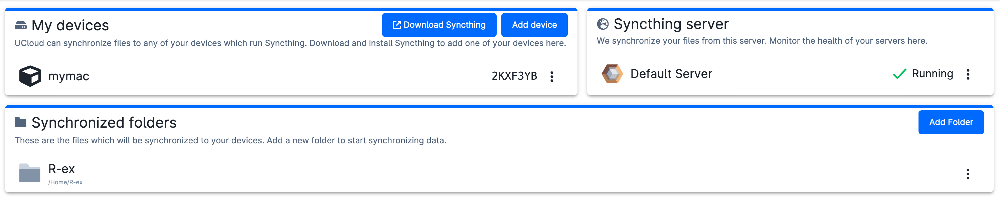

# Remote Synchronization

Quick and secure synchronization of data between UCloud and external user's devices can be done directly through the UCloud user interface or by using dedicated tools available in the *Apps* section.

## Synchronization via Syncthing

UCloud makes use of [Syncthing](https://docs.syncthing.net/intro/getting-started.html) in the backend to sync drives/folders with other computer devices.

::: {note}

This functionality is only available to the **DeiC interactive HPC (SDU)** provider.

:::

### Configure server

To initially configure the UCloud Syncthing server, the user must enter a drive and click on the button

{{ btn_sync_setup }}

at the top right of the page.

 

 

This button is only available when Syncthing is not yet configured.

The user will then be guided through the necessary configuration steps, which include:

- installing a 3rd-party Syncthing client
on the user's device

- adding the device identification to the server

- adding folder(s) to synchronize.

After completing the setup, a folder named *Syncthing* is created in the user's `Home` drive. This folder contains Syncthing configuration files.

### Synchronize drives

The full content of a drive can be added for synchronization by clicking on the button

{{ btn_add_to_sync }}

at the top right of the drive page

 

 

The drive can be removed afterwards, by clicking on the button

{{ btn_remove_from_sync }}

which became visible at the top right of the same page.

### Synchronize folders

Once the Syncthing server is up and running,  the user can add new folders any time by right-clicking on the folder name and selecting the option *Add to sync*.

 

 

Likewise, previously added folders can be removed from synchronization by selecting the option *Remove from sync*.

 

::: {note}

When adding a new folder on UCloud to sync, it can take few mins before asking confirmation locally and start the syncronization process.

:::

### Manage synchronization

Users can have an overview of devices, servers and folders involved in the synchronization process by clicking on the button

{{ btn_manage_sync }}

which opens the *management synchronization* page, similar to the figure below.
 

 

The same page can be accessed at [this URL](https://cloud.sdu.dk/app/syncthing).

From this page new devices and folders can be added by clicking on the buttons

{{ btn_add_dev_sync }}

or

{{ btn_add_folder }}

respectively. Additionally, the user can remove a device/folder from synchronization by clicking on the drop-down menu <object style="font-size:30px;font-weight:700;">&#x22EE;</object> on the right side of the corresponding device/folder name.

From the *Syncthing Server* panel, at the right top of the page, several options are available by clicking on the drop-down menu on the right.

 

 

Among the possible options:

- *Open interface* allows user to access the **Syncthing admin** interface

- *Restart* allows to restart the servers

- *Factory reset* allows the user to completely reset the Syncthing server configuration. As a result, the devices and folders are permanently removed from the server. This option could be necessary if Syncthing fails and/or the user configuration is broken.

::: {note}

The Syncthing admin interface can also be accessed from *My Workspace*, by selecting the *Runs* section from the side menu and clicking on the corresponding job. No credit is charged while the server is running.

:::

### Stop Syncthing

The Syncthing server can be stopped by killing the corresponding job in *My Workspace*. The service will automatically restart after accessing the *management synchronization* page.

To shut down the server permanently, the user must do a *factory reset* of the server.

## Additional synchronization tools

UCloud provides additional tools to synchronize files and folders from/to a remote server.

There are two applications that can be used for this purpose:

- [MinIO](../Apps/minio.md)
- [Rsync](../Apps/rsync.md)

::: {important}

These tools should be used whenever the user needs to transfer a large number of files at the same time.

:::
