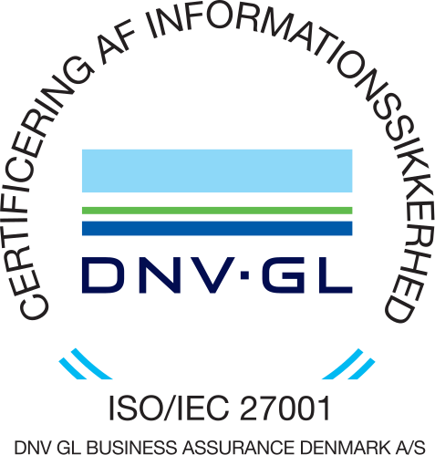

```{eval-rst}
.. _sphx_glr__intro_security:
```

# Secure Platform

UCloud is a highly secure platform for interactive high-performance computing suitable for sensitive data analyses in compliance with [GDPR regulations](https://www.sdu.dk/en/om_sdu/om_dette_websted/databeskyttelse).
UCloud is built from the ground up following rigorous security and privacy-by-design principles.
All the systems at the eScience Center are tested against comprehensive security benchmarks by the [Center for Internet Security (CIS)](https://www.cisecurity.org/).

We follow the highest standards of information security management with a formal ISO27001 certification.
The SDU eScience is ISO/IEC27001:2013 certified since February 2020, the first Danish university or public institution certified in the country.
<br>



<br>

<br>

<br>

<br>

<br>
